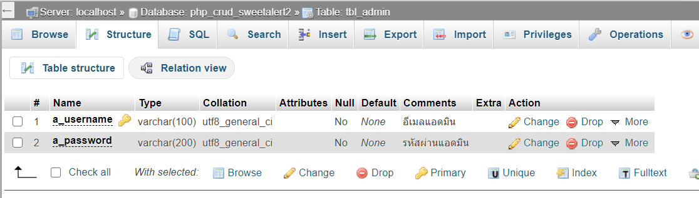
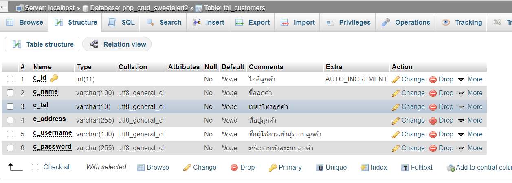
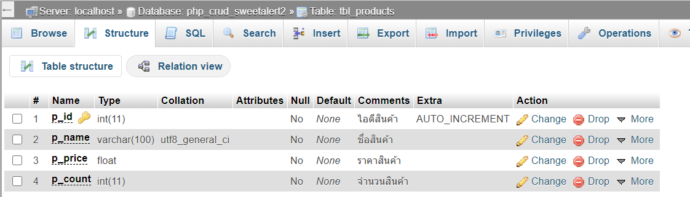

# ระบบจัดการหลังร้าน php_crud_sweetalert2

<h1>เข้าสู่ระบบ</h1>  

username = admin
 

password = admin@123
 
 

<h1>การเชื่อมฐานข้อมูล</h1>  

$host = "localhost";
 

$user = "root";
  

$password = "";
 

$database = "php_crud_sweetalert2";
  

#สนับสนุนค่าขนม เป็นกำลังในการพัฒนเวอร์ชันต่อไป

<a href="#">0202-9040-9372</a> ธนาคารออมสิน ณัฐกฤต ทิศเสถียร  

<h1>True money wallet<a href=""> : 0611033102</a></h1>  

ติดต่อ <a href="#"> : 061-103-3102</a> 

<h3>Facebook : <a href="https://www.facebook.com/profile.php?id=100040304628322">พี่เจมส์ ตาโต</a></h3>

<h1>หน้าเเสดง สินค้า</h1>

 
<h1>บันทึก สินค้า</h1>

 
 
 
 
<h1>ลบสินค้า</h1>

 

 
<h1>เเก้ไข สินค้า</h1>

 

 
<h1>เกี่ยวกับฉัน</h1>
 

<h1>โครงสร้างฐานข้อมูล</h1>

<h1>tbl_admin</h1>
 
<h1>tbl_customers</h1>
 
<h1>tbl_products</h1>
  
 
<h1>หมายเหตุ</h1>

<strong>tag</strong> : v1 ติดปัญหาการลบข้อมูล

<strong>tag</strong> : v1.1 เเก้ปัญหาการลบข้อมูล

<strong>ปัจจุบัน : </strong> : v1.1 โค้ดข่อนข้างสมบูรณ์ สามารถเเจ้งปัญหาได้ครับ จะรีบเเก้ไขชุดโค้ดเเละอัปเดดเวอร์ชันให้

